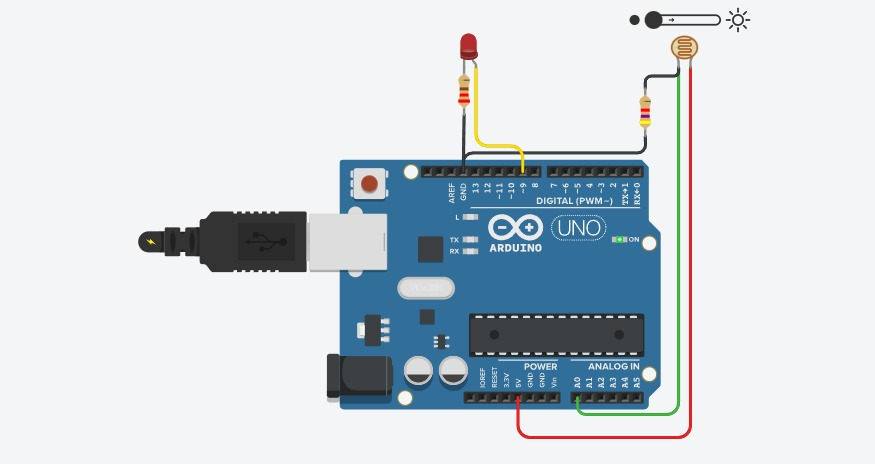
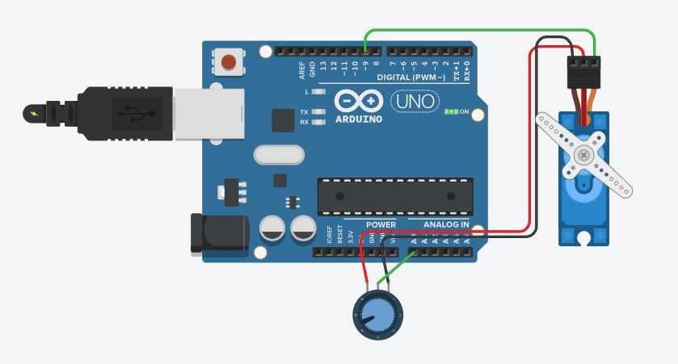
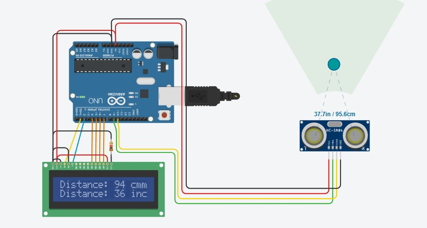

# Arduino-101

Twelve fundamentals I worked through while learning embedded — digital I/O, PWM, analog sensors,
LCDs, servos, buzzers. Each folder is a self-contained sketch with the wiring in the header comment.

Deliberately basic. This is the building-blocks repo; the larger projects live in my other
repositories.

---

## The sketches

Roughly in learning order — each adds something the previous one didn't have.

| # | Folder | What it does | New concept |
|---|---|---|---|
| 1 | [`blink`](blink) | Blinks the on-board LED | `digitalWrite`, `delay` |
| 2 | [`button_led`](button_led) | Button turns an LED on | digital input, `INPUT_PULLUP` |
| 3 | [`led_fade`](led_fade) | LED ramps up and down | PWM via `analogWrite` |
| 4 | [`traffic_light`](traffic_light) | Red → green → yellow cycle | sequencing and timing |
| 5 | [`ldr_night_light`](ldr_night_light) | LED comes on in the dark | analog input, thresholding |
| 6 | [`pot_brightness`](pot_brightness) | Knob dims an LED | `analogRead` + `map` + PWM |
| 7 | [`ultrasonic_lcd`](ultrasonic_lcd) | Distance meter, cm and inches | HC-SR04, `pulseIn`, parallel LCD |
| 8 | [`dht11_lcd`](dht11_lcd) | Temperature and humidity readout | I²C, handling failed reads |
| 9 | [`servo_knob`](servo_knob) | Potentiometer positions a servo | Servo library |
| 10 | [`pir_alarm`](pir_alarm) | Motion triggers buzzer and LED | PIR sensor, `tone` |
| 11 | [`buzzer_melody`](buzzer_melody) | Plays a scale on a piezo | note tables |
| 12 | [`lm35_thermometer`](lm35_thermometer) | LM35 temperature to Serial | analog sensor scaling |

Three include a Tinkercad simulation screenshot in their folder:

| | | |
|---|---|---|
|  |  |  |
| `ldr_night_light` | `servo_knob` | `ultrasonic_lcd` |

---

## Two things these sketches try to get right

**A sensor read can fail, and the failure has to be handled.**
`dht11_lcd` checks `isnan()` before using the value. Without that, a sensor that doesn't respond
prints `nan` on the display — which looks like a code bug but is really the sensor reporting a
problem. Same idea in `ultrasonic_lcd`, where `pulseIn` returns `0` on timeout rather than a real
distance.

**Don't clear an LCD you're about to redraw.**
`lcd.clear()` on every pass makes the display flicker visibly. Padding each line with trailing
spaces overwrites the old text without a blank frame in between.

---

## Running them

**On hardware:** open the folder's `.ino` in the Arduino IDE, wire it per the header comment,
select your board and port, upload. Sketches 8 and 9 need libraries from the Library Manager — DHT
sensor library, LiquidCrystal I2C, and Servo.

**Without hardware:** all twelve run in [Tinkercad Circuits](https://www.tinkercad.com/circuits) or
[Wokwi](https://wokwi.com). Add an Uno plus the parts listed in the header, paste the code, start
the simulation.

---

## Notes

Resistor values in the headers are typical — 220 Ω for LEDs, 10 kΩ for pull-ups and dividers.
Adjust for your parts.

Each folder is named to match its `.ino` file, which the Arduino IDE requires: rename one without
the other and the IDE refuses to open the sketch.

These are practice exercises, verified in simulation rather than characterised on a bench.
